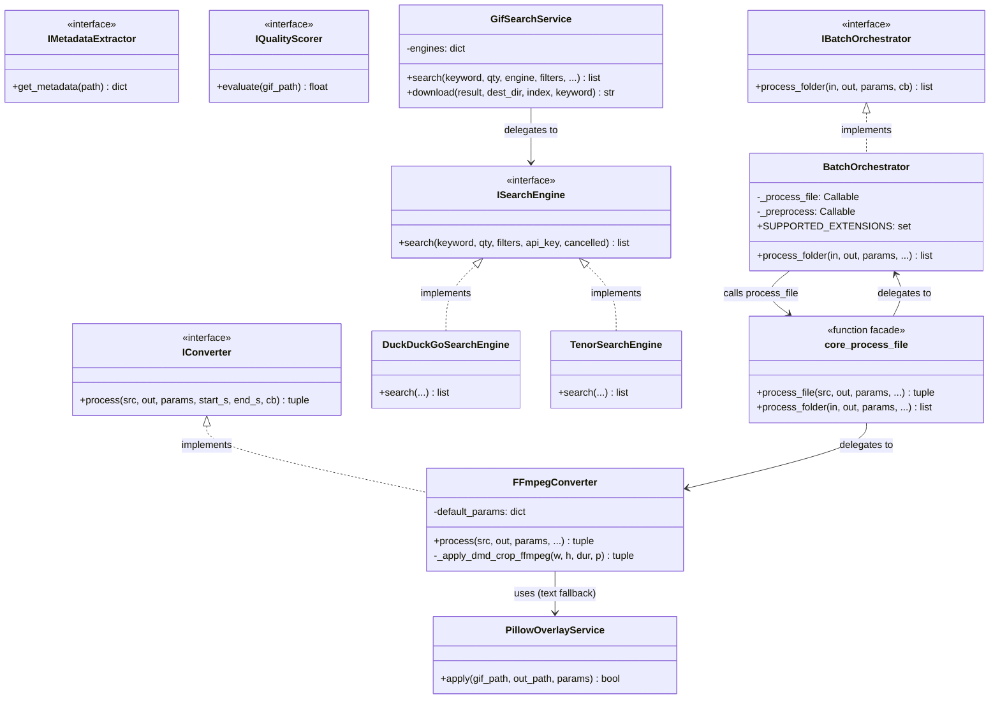
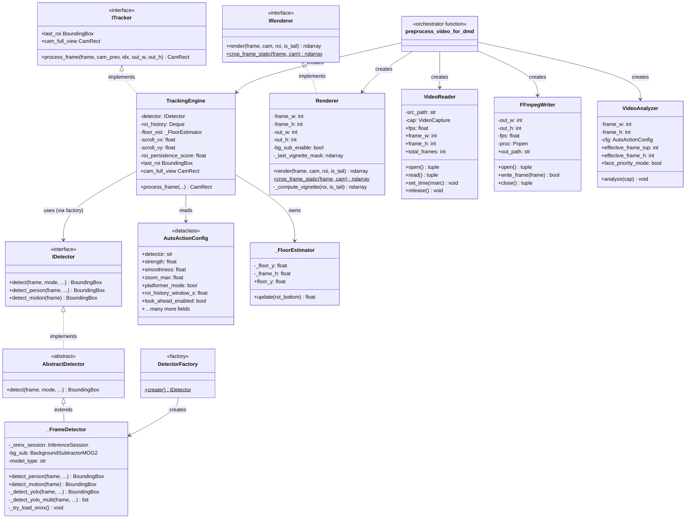
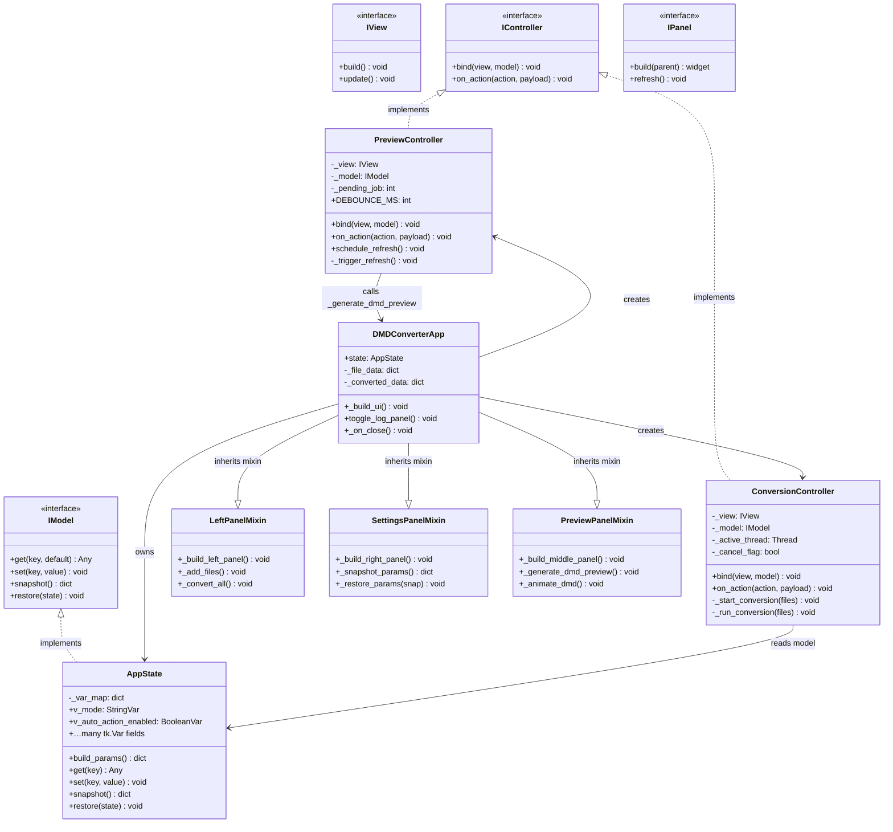
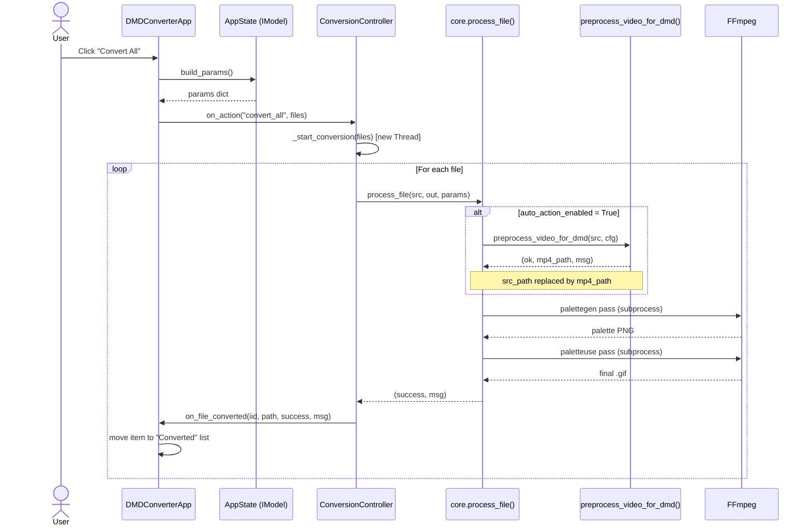
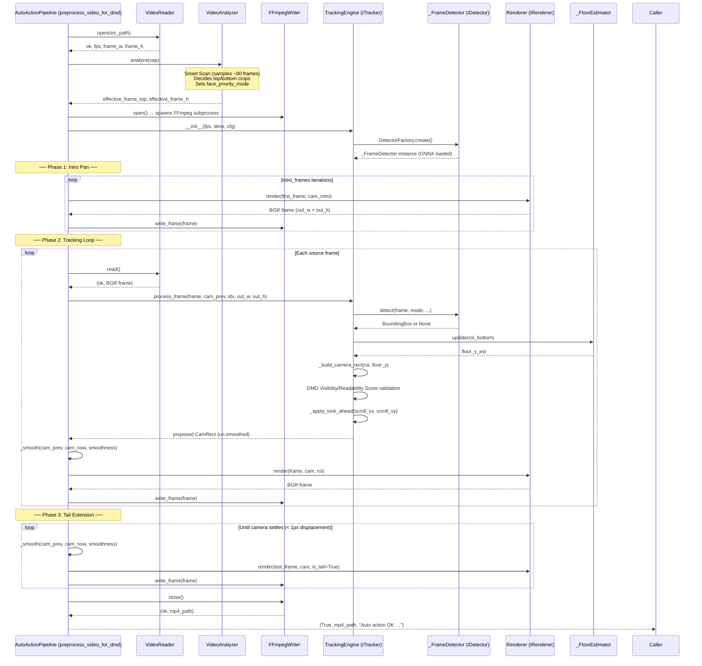
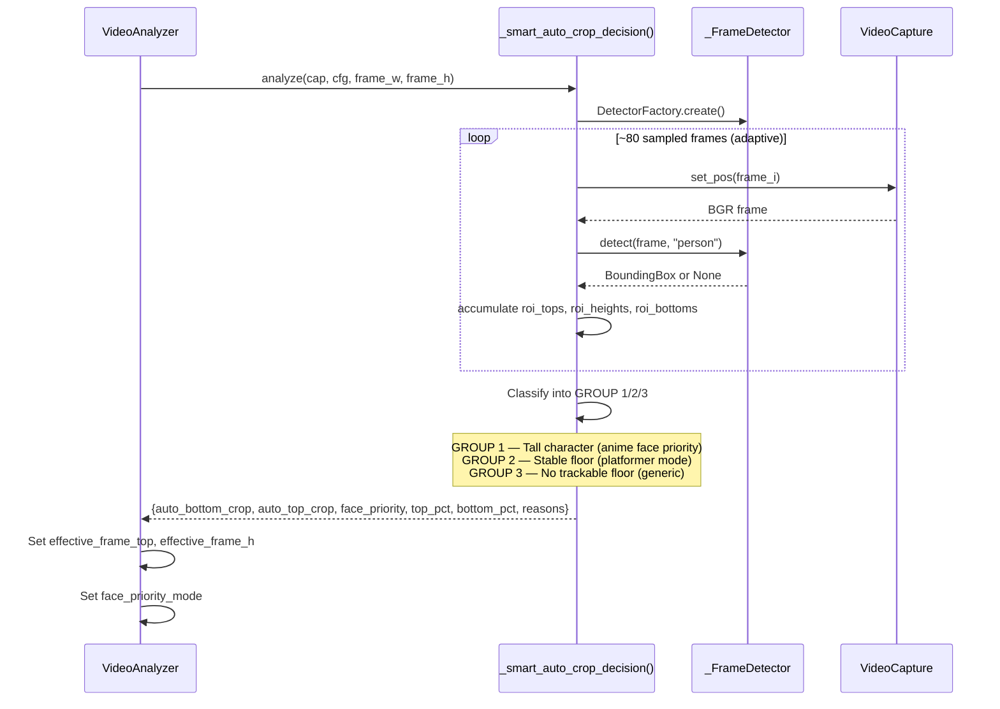
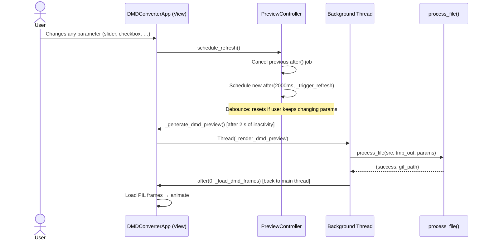
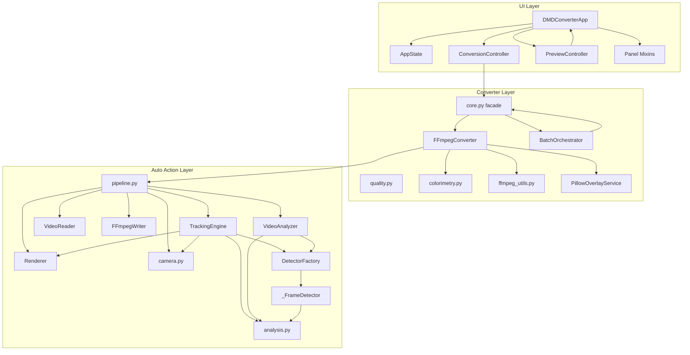

# DMD GIF Converter — Technical Architecture (v5.1.0)

> **Target audience:** Contributors, maintainers, and developers who need to understand how the codebase is structured, how data flows through the system, and where to add or change functionality.

---

## Table of Contents

1. [Overview](#1-overview)
2. [Repository Layout](#2-repository-layout)
3. [Layer Architecture](#3-layer-architecture)
4. [Interfaces & Abstract Base Classes](#4-interfaces--abstract-base-classes)
   - [4.1 Converter Layer — `src/converter/interfaces.py`](#41-converter-layer--srcconverterinterfacespy)
   - [4.2 Auto Action Layer — `src/auto_action/interfaces.py`](#42-auto-action-layer--srcauto_actioninterfacespy)
   - [4.3 UI Layer — `src/ui/interfaces.py`](#43-ui-layer--srcuiinterfacespy)
5. [Class Diagrams](#5-class-diagrams)
   - [5.1 Converter Layer](#51-converter-layer)
   - [5.2 Auto Action Layer (AI Tracking Engine)](#52-auto-action-layer-ai-tracking-engine)
   - [5.3 UI Layer (MVC)](#53-ui-layer-mvc)
6. [Data Flow & Sequence Diagrams](#6-data-flow--sequence-diagrams)
   - [6.1 Single-File Conversion](#61-single-file-conversion)
   - [6.2 Auto Action Pipeline (AI Framing)](#62-auto-action-pipeline-ai-framing)
   - [6.3 Smart Scan (Pre-analysis)](#63-smart-scan-pre-analysis)
   - [6.4 UI Preview Refresh Lifecycle](#64-ui-preview-refresh-lifecycle)
7. [Key Data Structures](#7-key-data-structures)
8. [Inter-Component Dependencies](#8-inter-component-dependencies)
9. [Configuration Reference (`AutoActionConfig`)](#9-configuration-reference-autoactionconfig)
10. [Testing Strategy](#10-testing-strategy)
11. [Extension Guide](#11-extension-guide)

---

## 1. Overview

The **DMD GIF Converter** transforms any video or GIF into a 128×32-pixel LED matrix animation (`.gif`) optimised for physical DMD (Dot Matrix Display) panels. Its defining feature is an **Auto Action Engine** — an AI-powered camera that tracks subjects using YOLO object detection, automatically frames the most interesting region, and smoothly animates a virtual camera to produce cinematic 128×32 output.

```
┌─────────────────────────────────────────────────────────────────┐
│                         User / GUI / CLI                         │
└─────────────────────────────────┬───────────────────────────────┘
                                  │ params dict
                                  ▼
┌─────────────────────────────────────────────────────────────────┐
│                    Converter Layer (FFmpeg)                       │
│  core.py  ·  services/  ·  ffmpeg_utils  ·  quality  ·  color   │
└─────────────────────────────────┬───────────────────────────────┘
                                  │ auto_action_enabled?
                                  ▼
┌─────────────────────────────────────────────────────────────────┐
│                  Auto Action Layer (AI Tracking)                  │
│  pipeline  ·  tracker  ·  detector  ·  camera  ·  renderer       │
│  reader    ·  writer   ·  analyzer  ·  analysis                  │
└─────────────────────────────────────────────────────────────────┘
```

---

## 2. Repository Layout

```
dmd_gif_converter/
├── src/
│   ├── auto_action/                  # AI tracking engine
│   │   ├── interfaces.py             ← IDetector, ITracker, IRenderer (ABC)
│   │   ├── config.py                 ← AutoActionConfig dataclass
│   │   ├── pipeline.py               ← AutoActionPipeline orchestrator
│   │   ├── tracker.py                ← TrackingEngine (ITracker)
│   │   ├── detector.py               ← AbstractDetector, _FrameDetector, DetectorFactory
│   │   ├── renderer.py               ← Renderer (IRenderer)
│   │   ├── reader.py                 ← VideoReader
│   │   ├── writer.py                 ← FFmpegWriter
│   │   ├── analyzer.py               ← VideoAnalyzer
│   │   ├── camera.py                 ← _build_camera_rect, _smooth, _crop_frame
│   │   └── analysis.py               ← _FloorEstimator, scoring functions
│   │
│   ├── converter/                    # FFmpeg conversion engine
│   │   ├── interfaces.py             ← IConverter, IMetadataExtractor, IQualityScorer, IBatchOrchestrator (ABC)
│   │   ├── core.py                   ← process_file(), process_folder() (public API)
│   │   ├── services/
│   │   │   ├── ffmpeg_converter.py   ← FFmpegConverter (IConverter)
│   │   │   ├── batch_orchestrator.py ← BatchOrchestrator (IBatchOrchestrator)
│   │   │   └── pillow_overlay.py     ← PillowOverlayService
│   │   ├── ffmpeg_utils.py           ← get_metadata, snap_to_clean_fps, …
│   │   ├── colorimetry.py            ← analyze_and_compensate
│   │   ├── quality.py                ← evaluate_gif_quality (0–100 score)
│   │   └── cli.py                    ← CLI entry point
│   │
│   └── ui/                           # Tkinter / CustomTkinter GUI
│       ├── interfaces.py             ← IModel, IView, IController, IPanel (ABC)
│       ├── app.py                    ← DMDConverterApp (main window)
│       ├── models/
│       │   └── app_state.py          ← AppState (IModel) — single source of truth
│       ├── controllers/
│       │   ├── conversion_controller.py  ← ConversionController (IController)
│       │   └── preview_controller.py    ← PreviewController (IController)
│       ├── panels/                   ← UI panel Mixins (left, middle, preview, settings, actions)
│       ├── widgets.py                ← _InfoBadge, reusable widgets
│       ├── dmd_led_sim.py            ← LED grid pixel simulation
│       └── constants.py              ← APP_VERSION, colors, fonts
│
├── tests/                            # 272 unit tests
│   ├── auto_action/
│   ├── converter/
│   └── ui/
└── resources/                        # test GIFs, fonts, ONNX model cache
```

---

## 3. Layer Architecture

The system is divided into **three independent layers**, each with its own set of abstract interfaces. Layers only communicate upwards through their public API — no layer imports from the layer above it.

```
┌────────────────────────────────────────────────────────────────────────┐
│  UI Layer      DMDConverterApp  ←  AppState (IModel)                   │
│  (Tkinter)     Panels (Mixins)  ←  ConversionController (IController)  │
│                                 ←  PreviewController (IController)     │
└────────────────────────────────────┬───────────────────────────────────┘
                                     │ calls process_file() / process_folder()
┌────────────────────────────────────▼───────────────────────────────────┐
│  Converter     core.py (public API facade)                              │
│  Layer         FFmpegConverter (IConverter)                             │
│                BatchOrchestrator (IBatchOrchestrator)                   │
│                PillowOverlayService                                     │
└────────────────────────────────────┬───────────────────────────────────┘
                                     │ calls preprocess_video_for_dmd()
┌────────────────────────────────────▼───────────────────────────────────┐
│  Auto Action   AutoActionPipeline (pipeline.py)                         │
│  Layer         TrackingEngine (ITracker) ← DetectorFactory → _FrameDetector (IDetector)
│  (AI/CV)       VideoAnalyzer             Renderer (IRenderer)           │
│                VideoReader               FFmpegWriter                    │
└────────────────────────────────────────────────────────────────────────┘
```

---

## 4. Interfaces & Abstract Base Classes

All interfaces are defined using Python's `abc.ABC` mechanism, which **enforces implementation at runtime** — attempting to instantiate a concrete class without implementing all abstract methods raises a `TypeError` immediately.

### 4.1 Converter Layer — `src/converter/interfaces.py`

| Interface | Abstract Methods | Purpose |
|---|---|---|
| `IConverter` | `process(src, out, params, start_s, end_s)` | Contract for a file-to-GIF converter |
| `IMetadataExtractor` | `get_metadata(file_path)` | Contract for reading video metadata |
| `IQualityScorer` | `evaluate(gif_path)` | Contract for DMD quality scoring |
| `IBatchOrchestrator` | `process_folder(in, out, params, …)` | Contract for parallel batch processing |
| `ISearchEngine` | `search(keyword, qty, filters, …)` | Contract for querying external GIF engines (DuckDuckGo, Tenor, Giphy) |

```python
# Example: IConverter enforces a single method
class IConverter(ABC):
    @abstractmethod
    def process(self, src_path, out_path, params, start_s=None, end_s=None, callback=None):
        pass

# FFmpegConverter implements it
class FFmpegConverter(IConverter):
    def process(self, src_path, out_path, params, ...):
        # Full FFmpeg 2-pass GIF pipeline
        ...
```

### 4.2 Auto Action Layer — `src/auto_action/interfaces.py`

| Interface | Abstract Methods | Purpose |
|---|---|---|
| `IDetector` | `detect()`, `detect_person()`, `detect_motion()` | Contract for ROI extraction backends |
| `ITracker` | `process_frame()`, `last_roi` (property), `cam_full_view` (property) | Contract for stateful camera tracking |
| `IRenderer` | `render()`, `crop_frame_static()` (static) | Contract for frame manipulation |

Type aliases used throughout this layer:
```python
BoundingBox = Tuple[int, int, int, int]    # (x, y, w, h)
CamRect     = Tuple[float, float, float, float]  # (cx, cy, cw, ch)  ← centre + size
```

### 4.3 UI Layer — `src/ui/interfaces.py`

| Interface | Abstract Methods | Purpose |
|---|---|---|
| `IModel` | `get()`, `set()`, `snapshot()`, `restore()` | Reactive state container |
| `IView` | `build()`, `update()` | UI component contract |
| `IController` | `bind(view, model)`, `on_action(action, payload)` | Event dispatcher |
| `IPanel` | `build(parent)`, `refresh()` | Individual panel widget contract |

---

## 5. Class Diagrams

### 5.1 Converter Layer



### 5.2 Auto Action Layer (AI Tracking Engine)



### 5.3 UI Layer (MVC)



---

## 6. Data Flow & Sequence Diagrams

### 6.1 Single-File Conversion



### 6.2 Auto Action Pipeline (AI Framing)

This is the core of the system — a 3-phase loop that produces an intermediary MP4 at the source's native resolution, with the AI-controlled camera already applied.



### 6.3 Smart Scan (Pre-analysis)

Runs once per file before the main loop. Samples N frames and decides which tracking optimisations to activate.



### 6.4 UI Preview Refresh Lifecycle



---

## 7. Key Data Structures

### `AutoActionConfig` (dataclass)

The configuration object passed through the entire Auto Action layer. Every parameter is explicitly typed with a safe default.

```python
@dataclass
class AutoActionConfig:
    detector: str = "person"          # "person" | "motion" | "hybrid" | "center"
    strength: float = 0.65            # 0..1  — tighter = more aggressive zoom
    smoothness: float = 0.85          # 0..0.98 — higher = slower camera
    zoom_max: float = 2.0             # hard limit on zoom-in factor
    padding: float = 0.20             # extra space around ROI before crop
    intro_duration: float = 1.5       # seconds of full-frame overview at start
    roi_history_window_s: float = 3.0 # seconds of ROI history for interpolation
    scene_change_threshold: float = 0.45 # 0..1 — resets tracking on hard cuts
    platformer_mode: bool = False     # floor-anchored tracking for 2D games
    look_ahead_enabled: bool = True   # anticipate movement direction
    multi_roi_fusion_enabled: bool = True # fuse multiple detections
    dmd_readability_score_enabled: bool = True  # reject blurry camera moves
    # …and 15+ more fields (see config.py for full reference)
```

### `CamRect` — `Tuple[float, float, float, float]`

The canonical representation of the virtual camera window:

```
CamRect = (cx, cy, cw, ch)

  cx, cy  — centre of the crop window (in source frame pixels)
  cw, ch  — width and height of the crop window (in source frame pixels)

  The actual pixel bounding box is:
    x1 = cx - cw/2,  y1 = cy - ch/2
    x2 = cx + cw/2,  y2 = cy + ch/2
```

Using centre+size (instead of top-left+size) makes linear interpolation (_smooth) trivial — you just lerp all 4 values directly without edge-case arithmetic.

### `BoundingBox` — `Tuple[int, int, int, int]`

```
BoundingBox = (x, y, w, h)   ← top-left + size (standard OpenCV convention)
```

---

## 8. Inter-Component Dependencies



---

## 9. Configuration Reference (`AutoActionConfig`)

| Field | Type | Default | Description |
|---|---|---|---|
| `detector` | `str` | `"person"` | Detection mode: `person`, `motion`, `hybrid`, `center` |
| `strength` | `float` | `0.65` | Framing tightness (0=full frame, 1=tight crop) |
| `smoothness` | `float` | `0.85` | Camera smoothing (0=instant, 0.98=very slow) |
| `zoom_max` | `float` | `2.0` | Maximum zoom factor allowed |
| `padding` | `float` | `0.20` | Extra space around detected ROI |
| `intro_duration` | `float` | `1.5` | Panoramic intro duration in seconds |
| `bg_sub_enable` | `bool` | `False` | Vignette darkening around subject |
| `roi_history_window_s` | `float` | `3.0` | Temporal memory window in seconds |
| `scene_change_threshold` | `float` | `0.45` | Sensitivity for hard-cut detection |
| `min_roi_area_ratio` | `float` | `0.02` | Reject ROIs smaller than this fraction of frame |
| `look_ahead_enabled` | `bool` | `True` | Anticipate movement direction |
| `look_ahead_factor` | `float` | `0.25` | Look-ahead strength |
| `multi_roi_fusion_enabled` | `bool` | `True` | Fuse multiple detections into one box |
| `min_subject_dmd_px` | `int` | `4` | Minimum subject size in DMD pixels |
| `platformer_mode` | `bool` | `False` | Lock floor visibility (side-scrollers) |
| `platformer_floor_ratio` | `float` | `0.80` | Floor position ratio in platformer mode |
| `roi_confidence_min` | `float` | `0.0` | Minimum YOLO confidence to accept |
| `dynamic_roi_confidence_enabled` | `bool` | `True` | Lower threshold when subject tracked consistently |
| `roi_persistence_score_enabled` | `bool` | `True` | Track confidence across frames |
| `scroll_direction_memory_enabled` | `bool` | `True` | Momentum for directional look-ahead |
| `dmd_visibility_score_enabled` | `bool` | `False` | Reject camera moves that reduce subject visibility |
| `dmd_readability_score_enabled` | `bool` | `True` | Reject blurry/unreadable DMD frames |
| `smart_auto_crop` | `bool` | `False` | Automatic crop mode detection via smart scan |
| `target_width` | `int` | `128` | DMD output width |
| `target_height` | `int` | `32` | DMD output height |

---

## 10. Testing Strategy

```
tests/
├── auto_action/
│   ├── test_analysis.py        # _FloorEstimator, DMD scoring functions, smart crop
│   ├── test_camera.py          # _build_camera_rect geometry, _smooth, _apply_look_ahead
│   ├── test_detector.py        # _FrameDetector (mocked ONNX), _fuse_rois, ROI history
│   ├── test_pipeline.py        # preprocess_video_for_dmd (edge cases, file errors)
│   ├── test_pipeline_mocks.py  # End-to-end mock: fake VideoCapture + fake FFmpeg
│   └── test_use_cases.py       # Semantic tests on real GIFs (platformer, anime, face)
├── converter/
│   ├── test_colorimetry.py
│   ├── test_core.py            # process_file, process_folder (mocked FFmpeg)
│   ├── test_ffmpeg_utils.py
│   └── test_quality_score.py
└── ui/
    ├── test_dmd_led_sim.py     # LED grid pixel simulation
    ├── test_per_gif_config.py  # Per-GIF config snapshot/restore
    └── test_ui_mixins.py       # UI logic (mocked Tkinter)
```

**Running the full suite:**
```bash
PYTHONPATH=. pytest tests/ -v
# Expected: 272 passed, 0 failed
```

**Mocking strategy:**

Because the Auto Action layer uses subprocesses and OpenCV, tests rely on:
- `unittest.mock.patch("cv2.VideoCapture")` — fake video source
- `unittest.mock.patch("src.auto_action.writer.subprocess.Popen")` — fake FFmpeg output pipe
- `unittest.mock.patch("src.auto_action.reader.subprocess.run")` — fake GIF pre-conversion
- `unittest.mock.patch("src.auto_action.detector._FrameDetector.detect")` — fake YOLO output

---

## 11. Extension Guide

### Adding a New Detector Backend

1. Create `src/auto_action/detectors/my_detector.py`
2. Inherit from `AbstractDetector` (which itself implements `IDetector`):

```python
from ..interfaces import IDetector, BoundingBox
from ..detector import AbstractDetector
import numpy as np

class MyCustomDetector(AbstractDetector):
    def detect_person(self, frame: np.ndarray, ...) -> BoundingBox | None:
        # Your detection logic
        return (x, y, w, h)

    def detect_motion(self, frame: np.ndarray) -> BoundingBox | None:
        return None  # Optional
```

3. Register in `DetectorFactory.create()`:

```python
class DetectorFactory:
    @staticmethod
    def create(mode: str = "default") -> IDetector:
        if mode == "my_custom":
            from .detectors.my_detector import MyCustomDetector
            return MyCustomDetector()
        return _FrameDetector()  # default
```

### Adding a New Conversion Backend

1. Create `src/converter/services/my_converter.py`
2. Implement `IConverter`:

```python
from ..interfaces import IConverter

class MyConverter(IConverter):
    def process(self, src_path, out_path, params, ...):
        # Your conversion logic
        return True, "OK"
```

3. Use it in `core.py` or inject it into `BatchOrchestrator`.

### Adding a New UI Panel

1. Create `src/ui/panels/my_panel.py`
2. Implement `IPanel`:

```python
from ..interfaces import IPanel

class MyPanelMixin(IPanel):
    def build(self, parent):
        self._my_frame = ctk.CTkFrame(parent)
        # ... build widgets
        return self._my_frame

    def refresh(self):
        # Update widget values from self.state
        pass
```

3. Mix it into `DMDConverterApp(ctk.CTk, ..., MyPanelMixin)`.

---

*Last updated: v5.1.0 — June 2026*
