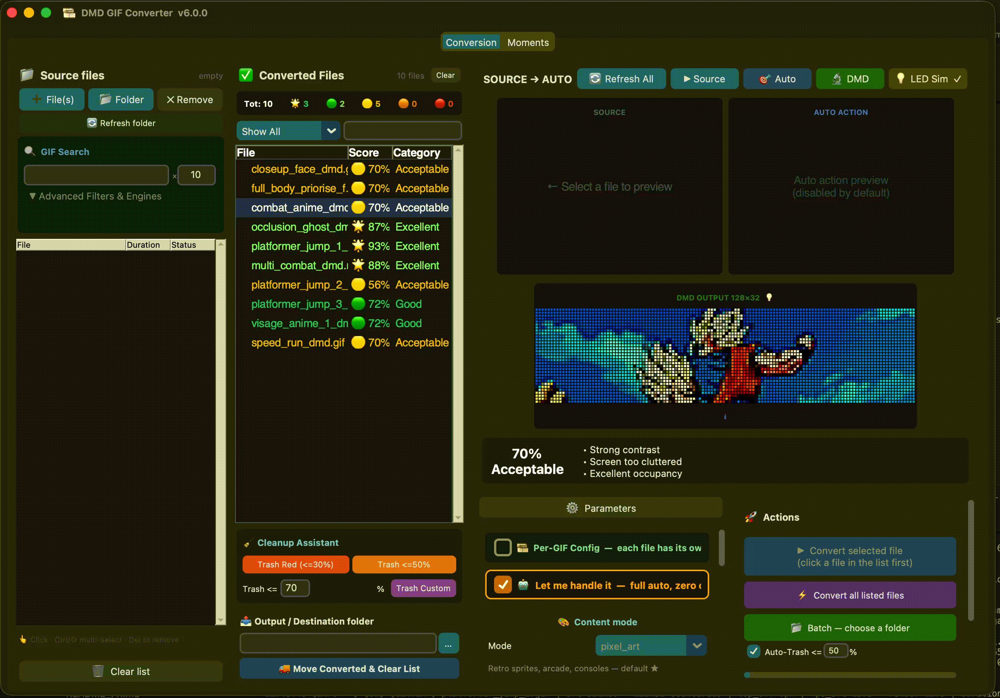

# 🎞️ DMD GIF Converter — v7.1.0

Converts **any animated GIF or video** (MP4, MKV, MOV, AVI, WEBM…) into a format optimised for a **128×32 HUB75 LED matrix panel** driven by an ESP32 (compatible with [Retro Pixel LED Lite](https://github.com/fjgordillo86/RetroPixelLED-Lite) and the [AnimatedGIF](https://github.com/bitbank2/AnimatedGIF) library).

Now ships with a **full cross-platform graphical interface** — no command line needed.

---

## 🌟 Discover the Power of DMD GIF Converter

Tired of manually cropping and adjusting videos for your low-res LED matrix? This engine automates the entire process using AI and computer vision.

- **🤖 AI Iconic Moments**: Automatically analyzes entire videos to find and extract the absolute best, most action-packed moments specifically tailored for a 128x32 display.
- **🎥 Cinematic Auto-Action Framing**: Uses YOLOv8 AI to track subjects, pan the camera dynamically, and crop the floor/ceiling to keep the action perfectly centered.
- **🎨 Smart Color Boost**: Automatically detects dark or washed-out scenes and injects the perfect amount of brightness, contrast, and saturation so your GIFs pop on LED panels.
- **🧠 Continuous Scoring Matrix**: Intelligently scores your scene (Platformer, Talking Closeup, Action) to select the perfect camera profile without any manual intervention.
- **⚡ Hardware Acceleration & Multithreading**: Auto-detects and uses hardware encoders (VideoToolbox on macOS, NVENC/QSV/AMF on Windows/Linux) and utilizes intelligent CPU auto-workers to massively accelerate batch video processing up to 10x.
- **🪄 Text Magic**: Add retro pixel-art text overlays with built-in animations directly onto your videos.

> **Curious about what changed recently?** Check out the [Release Changelog](docs/CHANGELOG.md).

## Table of Contents
- [🖥️ Graphical interface](#graphical-interface)
- [✨ Features at a glance](#features-at-a-glance)
- [🚀 Quick start](#quick-start)
- [🎩 Magic Commands (CLI Teaser)](#magic-commands-cli-teaser)
- [📚 Full Documentation](#full-documentation)
- [📋 Requirements](#requirements)
- [📄 License & Credits](#license--credits)


---

## 🖥️ Graphical interface

### Screenshots



### Features at a glance

| Feature | Details |
|---|---|
| **Import by file or folder** | ➕ individual files, 📂 entire folder — all video formats accepted |
| **Multi-select file list** | Ctrl+click / Shift+click to select multiple files · Del removes all selected at once |
| **Smart Conversion Lists** | Files move from **Files To Convert** to **Converted Files** automatically upon completion. |
| **DMD Quality Score** | Converted files receive a 0-100% Quality Score and |
| **Preview Panel** | Shows the original video, the OpenCV Auto-Action crop bounding box (if enabled), and the final DMD representation. |
| **Cleanup Assistant** | Instantly send bad conversions (e.g. <=30%, <=50%, or custom threshold) to the trash with one click. Files and metadata are permanently removed from the disk. |
| **Sortable List** | Click on the `File`, `Score`, or `Category` column headers in the Converted List to sort items in ascending/descending order. |
| **Smart Temp Folder** | If no output directory is defined, all files are stored in a `dmd_tmp/` subfolder inside your source folder to prevent mixing converted GIFs with your source videos. |
| **🔍 GIF Search** | Search & download GIFs from DuckDuckGo — keyword + quantity (up to 300), auto-populates the list |
| **🤖 AI Iconic Moments** | Auto-extracts the best moments from long videos based on 5 AI metrics and exports directly to the Converter |
| **Triple live preview** | SOURCE (left) + AUTO ACTION intermediate (middle) + DMD OUTPUT (right) |
| **Diagnostic Preview** | Clicking a converted file shows its score, rating, and bullet-point reasons explaining the score. |
| **💡 LED Sim** | Toggle pixel-grid overlay on the DMD preview — simulates the physical HUB75 LED matrix appearance · **ON by default** |
| **DMD auto-refresh** | DMD preview rebuilds automatically ~2 s after you stop moving any slider |
| **Trim / clip** | Set start and end time — single-file conversion only |
| **⏱ Max Duration** | Cap clip length + place the window anywhere in the source |
| **🚀 Let Me Handle It** | One-click full-auto mode — activates all 5 AI systems (Smart Color Boost + Auto Action + Smart Auto Crop + Background Subtraction + DMD Visibility Score) and grays out unrelated settings |
| **🎨 Smart Color Boost** | One-click AI colorimetry — auto-adjusts contrast, saturation and gamma per source |
| **🎞️ Per-GIF Config** | Global toggle — when ON each file stores its own independent copy of all ~50 parameters · config saved instantly on selection change |
| **All standard parameters** | Sliders and drop-downs for mode, scroll, FPS, colorimetry |
| **🔧 Advanced Settings** | Collapsible panel — all extras hidden by default, default values never alter the output |
| **Batch folder** | Convert an entire folder in one click |
| **Convert all listed files** | One click to process the whole current list |
| **Real-time log** | Live progress feed in the UI |
| **Cross-platform** | macOS · Windows · Linux |

---

## 🚀 Quick start

```bash
git clone https://github.com/red77290/dmd_gif_converter.git
cd dmd_gif_converter
```

Then launch with the script for your OS — **it sets everything up automatically on the first run** (creates a Python venv, installs dependencies):

| OS | Command |
|---|---|
| 🍎 macOS / 🐧 Linux | `./launch_ui.sh` |
| 🪟 Windows (double-click) | `launch_ui.bat` |
| 🪟 Windows (PowerShell) | `.\launch_ui.ps1` |

> **Why a launcher script instead of plain `python3`?**  
> On macOS, the system Python (CommandLineTools) ships with Tcl/Tk 8.5 which **crashes on macOS 15+ / 26 (Tahoe)**. The launcher automatically picks Homebrew Python 3.13 (Tk 9.0) and isolates dependencies in a venv.  
> On Linux, make sure `python3-tk` is installed alongside Python:  
> `sudo apt install python3-tk` · `sudo dnf install python3-tkinter` · `sudo pacman -S tk`

---

## 📚 Full Documentation

To keep this README clean, our most powerful features have dedicated guides. Discover what the engine can really do:

### [🤖 AI Moments & Studio Timeline](docs/AI_MOMENTS.md)
Tired of manually searching for the best part of a 2-hour movie? The **AI Moments Engine** analyzes your video to find the most action-packed, epic, and DMD-friendly scenes. Trim them perfectly using the interactive **Studio Timeline** loop playback, or let the CLI extract the top 5 moments automatically! 
👉 **[Read the AI Moments Guide](docs/AI_MOMENTS.md)**

### [🎥 Cinematic Auto-Action Framing](docs/ADVANCED_FEATURES.md#auto-action-framing)
When scaling a 1080p video down to a 128x32 matrix, subjects become microscopic. The **Auto-Action Framing** feature uses YOLOv8 ONNX AI to dynamically track subjects, pan the camera, and smartly crop the floor/ceiling to keep the action centered and visible on your DMD!
👉 **[Read the Advanced Features Guide](docs/ADVANCED_FEATURES.md)**

### [🎨 Smart Color Boost & Filters](docs/ADVANCED_FEATURES.md#smart-color-boost)
LED matrices wash out dark colors and overdrive bright ones. **Smart Color Boost** uses heuristic analysis to automatically inject the perfect amount of brightness, contrast, and saturation into your GIF.
👉 **[Read the Advanced Features Guide](docs/ADVANCED_FEATURES.md)**

### [💻 CLI Automation Mastery](docs/CLI_MANUAL.md)
Everything you can do in the UI, you can automate in the Terminal. Download GIFs straight from DuckDuckGo, process entire folders in parallel, overlay pixel-art text, and automatically trash low-quality conversions!
👉 **[Read the CLI Manual](docs/CLI_MANUAL.md)**

### [❓ Troubleshooting & Setup](docs/TROUBLESHOOTING.md)
Running into OpenCV or FFmpeg issues? Need help with installation on a specific OS?
👉 **[Read the Troubleshooting Guide](docs/TROUBLESHOOTING.md)**


---

## 📋 Requirements

### 1 — System: Python 3.8+ and FFmpeg

#### 🍎 macOS
```bash
/bin/bash -c "$(curl -fsSL https://raw.githubusercontent.com/Homebrew/install/HEAD/install.sh)"
brew install ffmpeg
```

#### 🪟 Windows
```powershell
winget install Gyan.FFmpeg
```
Or download from [ffmpeg.org](https://ffmpeg.org/download.html) and add `C:\ffmpeg\bin` to your `PATH`.

#### 🐧 Linux (Debian / Ubuntu)
```bash
sudo apt update && sudo apt install python3 ffmpeg
```

**Fedora:**
```bash
sudo dnf install https://download1.rpmfusion.org/free/fedora/rpmfusion-free-release-$(rpm -E %fedora).noarch.rpm
sudo dnf install python3 ffmpeg
```

**Arch:**
```bash
sudo pacman -S python ffmpeg
```

**Verify:**
```bash
python3 --version   # 3.8+
ffmpeg -version
```

---

### 2 — Python dependencies (UI only)

```bash
pip install -r requirements_ui.txt
```

Or directly:
```
pip install customtkinter Pillow "darkdetect==0.7.1" opencv-python onnxruntime duckduckgo-search requests
```

> `dmd_gif_converter.py` (CLI / engine) has **zero external dependencies** — standard library only.  
> `opencv-python` and `onnxruntime` are optional — only required for the **Auto Action** AI feature. If absent, Auto Action is silently skipped.  
> The YOLOv8n ONNX model (~6 MB) is downloaded automatically to `~/.cache/dmd_gif_converter/` on first use.

---

## 🛠️ For Developers

If you wish to contribute or understand how the app works under the hood (MVC architecture, Auto-Action Pipeline, FFmpeg Streaming), please refer to our **[Architectural Documentation](docs/architecture.md)**.

---

## 📄 License & Credits

MIT — free to use, modify and distribute.

---

## 🙏 Credits

- **[FFmpeg](https://ffmpeg.org/)** — video processing engine
- **[CustomTkinter](https://github.com/TomSchimansky/CustomTkinter)** — modern cross-platform UI framework
- **[Pillow](https://python-pillow.org/)** — image handling for the UI preview and text overlay fallback
- **[DuckDuckGo](https://duckduckgo.com/)** — image search API powering the GIF Search feature (no API key required)
- **[duckduckgo-search](https://github.com/deedy5/duckduckgo_search)** — Python wrapper for the DuckDuckGo search API
- **[Requests](https://docs.python-requests.org/)** — HTTP library used for GIF downloads
- **[Bitbank2](https://github.com/bitbank2/AnimatedGIF)** — AnimatedGIF library for ESP32
- **[Mrfaptastic](https://github.com/mrfaptastic/ESP32-HUB75-MatrixPanel-DMA)** — high-performance DMA HUB75 driver for ESP32
- **[Retro Pixel LED Lite](https://github.com/fjgordillo86/RetroPixelLED-Lite)** — the project this tool was built for
- **[Pixel Fonts Pack by ovate](https://github.com/ovate/Pixel-Fonts-Pack)** — pixel-perfect TTF fonts bundled in `media/fonts/`
