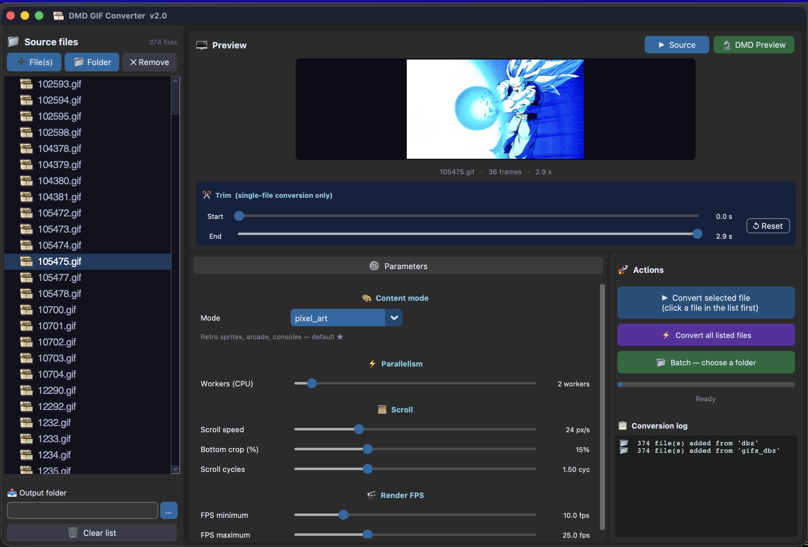
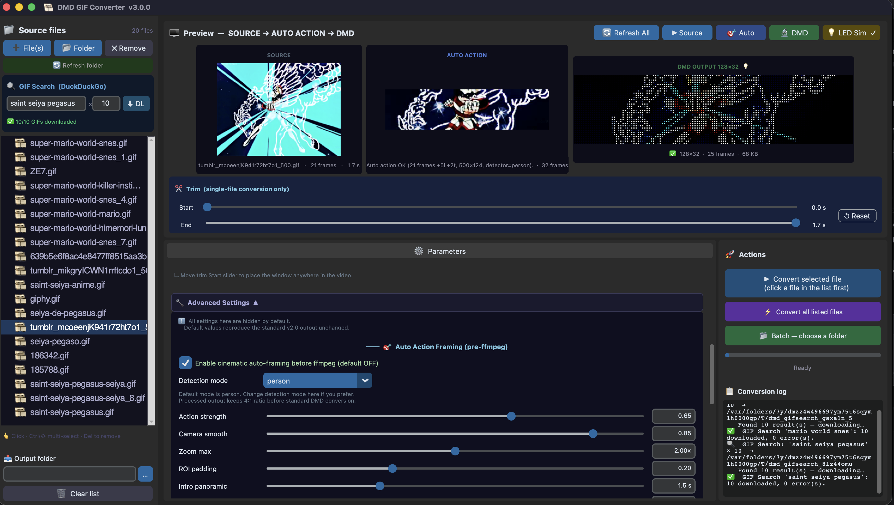

# 🎞️ DMD GIF Converter — v2.1

Convertit **n'importe quel GIF animé ou fichier vidéo** (MP4, MKV, MOV, AVI, WEBM…) en un format optimisé pour une **dalle LED HUB75 128×32 pixels** pilotée par un ESP32 (compatible [Retro Pixel LED Lite](https://github.com/fjgordillo86/RetroPixelLED-Lite) et la bibliothèque [AnimatedGIF](https://github.com/bitbank2/AnimatedGIF)).

Désormais livré avec une **interface graphique complète multi-plateforme** — aucune ligne de commande nécessaire.

## ✨ Ce que fait le script

| Situation | Comportement |
|---|---|
| GIF / vidéo **plus haut que 32 px** (personnage, scène) | Scroll N cycles (bas→haut), puis s'arrête à une position configurable |
| GIF / vidéo **plus large que haut** (logo, bannière) | Centrage statique, durée naturelle respectée |

**Pipeline de traitement :**
1. Fond noir composite (élimine la transparence → plus d'horloge qui transparaît)
2. Mise à l'échelle proportionnelle à 128 px de large, `bottom_crop_pct` % du bas ignorés
3. Colorimétrie boostée pour dalle LED (contraste, saturation, gamma, sharpening)
4. Crop 128×32 avec scroll intelligent (nombre de cycles + position d'arrêt)
5. Génération de palette sur les pixels réellement affichés (256 couleurs)
6. Encodage GIF sans transparence ni delta encoding

---

## 🖥️ Interface graphique

### Captures d'écran

**Double aperçu en direct** — SOURCE (source animée, gauche) + SORTIE DMD (résultat 128×32 agrandi ×2.5, droite) :



**Panneau Paramètres Avancés** — Positionnement manuel + effets visuels, masqués par défaut :



### Fonctionnalités

| Fonctionnalité | Détails |
|---|---|
| **Import par fichier ou dossier** | ➕ fichiers individuels, 📂 dossier entier — tous les formats vidéo acceptés |
| **Double aperçu en direct** | SOURCE (animée, gauche) + SORTIE DMD 128×32 (droite) — toujours visibles côte à côte |
| **Auto-refresh DMD** | L'aperçu DMD se regénère automatiquement ~2 s après le dernier déplacement de curseur |
| **Trim / extrait** | Définit un début et une fin — mode fichier unique uniquement |
| **Tous les paramètres standards** | Curseurs et menus pour le mode, le scroll, les FPS, la colorimétrie |
| **🔧 Paramètres avancés** | Panneau rétractable — masqué par défaut, valeurs par défaut = sortie identique à v2.0 |
| **Batch dossier** | Convertit un dossier entier en un clic |
| **Convertir toute la liste** | Un clic pour traiter tous les fichiers listés |
| **Journal en temps réel** | Progression visible dans l'interface |
| **Multi-plateforme** | macOS · Windows · Linux |

### 🔧 Panneau Paramètres Avancés (nouveau en v2.1)

Cliquer sur le bouton **🔧 Advanced Settings ▼** en bas du panneau Paramètres.  
Toutes les valeurs par défaut = « aucun effet » — la sortie standard est identique à v2.0.

#### 📍 Positionnement

| Contrôle | Description | Défaut |
|---|---|---|
| **Auto vertical scroll** ✅ | Coché = comportement de défilement standard (inchangé) | ✅ coché |
| **Zoom** | Multiplicateur de mise à l'échelle avant crop (1.0 = ajusté à 128 px) | `1.0×` |
| **X offset** | Décalage horizontal du crop en pixels (mode manuel uniquement) | `0 px` |
| **Y offset** | Décalage vertical du crop en pixels (mode manuel uniquement) | `0 px` |

> Décocher **Auto vertical scroll** pour activer le mode manuel. Augmenter d'abord le Zoom,
> puis régler X/Y pour choisir exactement quelle fenêtre 128×32 extraire.
> L'aperçu DMD se met à jour automatiquement ~2 s après l'arrêt du glissement.

#### ✨ Effets visuels

| Effet | Filtre | Défaut |
|---|---|---|
| **Hue shift** (décalage de teinte) | ffmpeg `hue=h=…` | `0°` (inactif) |
| **Noise reduction** (réduction de bruit) | ffmpeg `hqdn3d` | `0` (inactif) |
| **Film grain** (grain de film) | ffmpeg `noise=alls=…` | `0` (inactif) |
| **Vignette** | ffmpeg `vignette` | ☐ décoché |

Tous les effets sont désactivés par défaut. Une valeur non nulle ajoute des passes de filtres ffmpeg *après* la chaîne de colorimétrie standard.

### Lancer l'interface

```bash
./launch_ui.sh          # macOS / Linux  (recommandé — gère le venv automatiquement)
python3 dmd_gif_converter_ui.py   # si le venv est déjà activé
```

---

## 📋 Prérequis

### 1 — Système : Python 3.8+ et FFmpeg

#### 🍎 macOS

```bash
/bin/bash -c "$(curl -fsSL https://raw.githubusercontent.com/Homebrew/install/HEAD/install.sh)"
brew install ffmpeg
```

> Python est préinstallé sur macOS. Si besoin : `brew install python`

#### 🪟 Windows

```powershell
winget install Gyan.FFmpeg
```

Ou télécharger manuellement depuis [ffmpeg.org](https://ffmpeg.org/download.html) et ajouter `C:\ffmpeg\bin` au **PATH** :
- Rechercher « Variables d'environnement » dans le menu Démarrer
- `Variables système` → `Path` → `Modifier` → `Nouveau` → `C:\ffmpeg\bin`

#### 🐧 Linux

**Debian / Ubuntu / Mint**
```bash
sudo apt update && sudo apt install python3 ffmpeg
```

**Fedora**
```bash
sudo dnf install https://download1.rpmfusion.org/free/fedora/rpmfusion-free-release-$(rpm -E %fedora).noarch.rpm
sudo dnf install python3 ffmpeg
```

**Arch Linux**
```bash
sudo pacman -S python ffmpeg
```

**Vérification :**
```bash
python3 --version   # 3.8+
ffmpeg -version
```

---

### 2 — Dépendances Python (interface graphique uniquement)

```bash
pip install -r requirements_ui.txt
```

Ou directement :
```bash
pip install customtkinter Pillow "darkdetect==0.7.1"
```

> `dmd_gif_converter.py` (moteur CLI) **n'a aucune dépendance externe** — bibliothèque standard Python uniquement.

---

## 🚀 Démarrage rapide

```bash
git clone hhttps://github.com/red77290/dmd_gif_converter.git
cd dmd_gif_converter
```

Lancez ensuite le script correspondant à votre OS — **tout est configuré automatiquement à la première exécution** (création du venv, installation des dépendances) :

| OS | Commande |
|---|---|
| 🍎 macOS / 🐧 Linux | `./launch_ui.sh` |
| 🪟 Windows (double-clic) | `launch_ui.bat` |
| 🪟 Windows (PowerShell) | `.\launch_ui.ps1` |

> **Pourquoi un script de lancement ?**  
> Sur macOS, le Python système (CommandLineTools) embarque Tcl/Tk 8.5 qui **plante sur macOS 15+ / 26 (Tahoe)**. Le script utilise automatiquement le Python 3.13 de Homebrew (Tk 9.0) dans un venv isolé.  
> Sur Linux, assurez-vous que `python3-tk` est installé :  
> `sudo apt install python3-tk` · `sudo dnf install python3-tkinter` · `sudo pacman -S tk`

---

## ▶️ Utilisation en ligne de commande (sans interface)

Placez le script dans le dossier contenant vos dossiers `gifs_*` :

```
mon_dossier/
├── dmd_gif_converter.py
├── gifs_Arcade/
│   ├── mslug.gif
│   └── kof98.mp4        ← MP4, MKV, MOV, AVI, WEBM… aussi acceptés
└── gifs_Consoles/
    └── mario.gif
```

```bash
# Par défaut : mode pixel_art, détecte automatiquement les dossiers gifs_*
./dmd_gif_converter.py

# Changer le mode ou le nombre de workers
./dmd_gif_converter.py --mode anime --workers 6

# Traiter des dossiers spécifiques
./dmd_gif_converter.py gifs_Arcade gifs_Consoles

# Colorimétrie custom complète
./dmd_gif_converter.py --mode custom --saturation 2.8 --contrast 1.7

# Régler le scroll
./dmd_gif_converter.py --scroll-speed 32 --scroll-cycles 1.75

# Aide
./dmd_gif_converter.py --help
```

Les dossiers de sortie sont créés automatiquement (`Arcade/`, `Consoles/`…).

**Exemple de log :**
```
12:34:01 [INFO   ] === gifs_Arcade → Arcade  (42 file(s)) | mode=pixel_art ===
12:34:02 [INFO   ] [SCROLL ] mslug.gif | src 320x240 → 128x96 | scroll_dist=64px | cycles=1.5 (full=1 frac=0.50 stop=32px) | fps=12.5 | total=4.54s
12:34:04 [INFO   ] [OK    ] mslug.gif
```

---

## ⚙️ Paramètres

Tous les paramètres sont accessibles via **curseurs et listes déroulantes dans l'interface**, et via **flags `--arg` en ligne de commande**.

### Mode de contenu

| Mode | Pour quel contenu | Saturation | Sharpening |
|---|---|---|---|
| `pixel_art` | Sprites rétro, arcade, consoles ★ défaut | `2.2` 🔥 max | `1.8` agressif |
| `anime` | Anime / cartoon (plus doux) | `1.9` ✨ vif | `1.3` net |
| `cinema` | Films live, vidéos réelles | `1.3` 🎞️ naturel | `0.8` doux |
| `custom` | Réglage manuel de chaque valeur | libre | libre |

### Référence complète des paramètres

| Paramètre | Flag CLI | Défaut | Description |
|---|---|---|---|
| `max_workers` | `--workers` | `2` | Processus ffmpeg en parallèle |
| `scroll_speed` | `--scroll-speed` | `24.0` | Vitesse de défilement (px/s) |
| `bottom_crop_pct` | `--bottom-crop` | `0.15` | Part du bas ignorée (pieds, sol) |
| `scroll_cycles` | `--scroll-cycles` | `1.5` | Nombre de cycles + position d'arrêt (voir ci-dessous) |
| `fps_min` | `--fps-min` | `10.0` | FPS minimum (upsampling si source plus lent) |
| `fps_max` | `--fps-max` | `25.0` | FPS maximum (plafond ESP32) |
| `contrast` | `--contrast` | `1.6` | Mode custom — 0.5 à 2.5 |
| `saturation` | `--saturation` | `2.2` | Mode custom — 0.0 à 4.0 |
| `brightness` | `--brightness` | `-0.03` | Mode custom — compensation dalle LED |
| `gamma` | `--gamma` | `0.85` | Mode custom — correction gamma |
| `sharpen_lum` | `--sharpen-lum` | `1.8` | Netteté luminance |
| `sharpen_chr` | `--sharpen-chr` | `0.5` | Netteté chroma |
| `dither` | `--dither` | `none` | `none` recommandé pour contenu défilant |

**Paramètres avancés** (interface uniquement — pas de flag CLI, tous défaut = aucun changement) :

| Paramètre | Défaut | Description |
|---|---|---|
| `scroll_enabled` | `True` | `False` = mode crop manuel |
| `zoom` | `1.0` | Multiplicateur de mise à l'échelle avant crop |
| `manual_x` | `0` | Décalage horizontal du crop en px (mode manuel) |
| `manual_y` | `0` | Décalage vertical du crop en px (mode manuel) |
| `hue_shift` | `0.0` | Rotation de teinte en degrés |
| `noise_reduction` | `0.0` | Force du filtre hqdn3d |
| `film_grain` | `0` | Quantité de bruit additif |
| `vignette` | `False` | Assombrissement des bords |

### `scroll_cycles` expliqué

La partie entière = nombre d'**allers-retours complets** (bas→haut) ; la partie fractionnaire × `scroll_dist` = **position d'arrêt** où l'image se fige jusqu'à la fin de la source :

| Valeur | Comportement |
|---|---|
| `0.5` | Descend à mi-chemin, s'arrête au centre |
| `1.0` | 1 aller-retour, s'arrête en haut |
| `1.5` ★ défaut | 1 aller-retour puis s'arrête au centre (50 %) |
| `1.75` | 1 aller-retour puis s'arrête aux ¾ |
| `2.0` | 2 allers-retours, s'arrête en haut |

### Réglage de `--workers`

| Machine | Recommandé |
|---|---|
| MacBook Pro M3 Pro (11 cœurs, 36 Go) | `8` |
| Desktop SSD, 8+ cœurs, 16 Go+ | `6`–`8` |
| Desktop SSD, 4 cœurs, 8 Go | `3`–`4` |
| Laptop ou disque dur (HDD) | `2` |

---

## 🔍 Comportement détaillé

### Contenu haut — scroll intelligent

```
[cycle 1]  haut ──bas──▶ fond ──haut──▶ haut
[partiel]  haut ──bas──▶ stop_pos ──pause jusqu'à fin source──▶ (boucle)
```

- **`scroll_cycles = 1.5`** (défaut) : 1 aller-retour complet puis descend jusqu'au centre (50 % de la distance), s'arrête là
- **Crop du bas** (`bottom_crop_pct`) : les 15 % inférieurs (pieds, sol) sont ignorés → distance de scroll réduite
- Vitesse **constante en px/seconde** indépendamment du FPS source
- FPS de sortie snappé sur les valeurs propres GIF (10, 12,5, 20, 25 fps) — zéro judder

### Contenu large — centrage statique

L'image est **centrée verticalement** sur les 32 px de la dalle. Durée source respectée (minimum 1 s).

### Élimination de la transparence

| Couche | Mécanisme |
|---|---|
| `color=black` + `overlay` | Fond noir composite — alpha source → noir |
| `-gifflags -offsetting-transdiff` | Désactive le delta encoding GIF |

---

## ❓ Dépannage

| Problème | Solution |
|---|---|
| `ffmpeg: command not found` | FFmpeg non installé ou pas dans le PATH |
| Aperçu vide | FFmpeg doit être installé et accessible dans le PATH |
| `[ERROR] xxx — metadata unreadable` | Fichier corrompu ou format non supporté |
| Conversion très lente | Augmenter `--workers` (SSD + multi-cœurs recommandé) |
| Couleurs trop saturées | Passer en `--mode anime` ou baisser `--saturation` en mode custom |
| GIF trop sombre | Augmenter `--brightness` (ex. `0.05`) ou `--gamma` (ex. `0.95`) |
| Scroll trop rapide / lent | Ajuster `--scroll-speed` (défaut : `24.0`) |
| Arrêt à la mauvaise position | Ajuster `--scroll-cycles` (défaut `1.5` = arrêt au centre) |
| Banding sur les dégradés | Passer en mode `anime` ou `cinema` — le dithering crée des raies avec du contenu défilant |
| L'aperçu DMD ne se rafraîchit pas | Attendre ~2 s après le dernier déplacement de curseur ; vérifier qu'un fichier est sélectionné |
| Mode manuel montre la mauvaise zone | Augmenter d'abord le Zoom, puis ajuster les curseurs X/Y |

---

## 📄 Licence

MIT — libre d'utilisation, modification et distribution.

---

## 🙏 Remerciements

- **[FFmpeg](https://ffmpeg.org/)** — moteur de traitement vidéo
- **[CustomTkinter](https://github.com/TomSchimansky/CustomTkinter)** — interface graphique moderne multi-plateforme
- **[Pillow](https://python-pillow.org/)** — gestion des images pour l'aperçu
- **[Bitbank2](https://github.com/bitbank2/AnimatedGIF)** — bibliothèque AnimatedGIF pour ESP32
- **[Mrfaptastic](https://github.com/mrfaptastic/ESP32-HUB75-MatrixPanel-DMA)** — moteur DMA HUB75 pour ESP32
- Projet **[Retro Pixel LED Lite](https://github.com/fjgordillo86/RetroPixelLED-Lite)**
