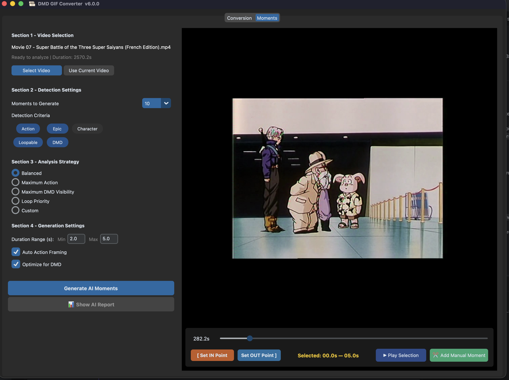

# AI Moments & Smart Tracking



DMD GIF Converter includes an advanced **AI Moments** feature designed to automatically analyze long videos and extract the best moments for your physical DMD displays. 

## How it works (Scoring V2 Engine)

The AI Moments engine runs a multi-pass analysis on your video using the **Scoring V2 Engine**, which splits evaluation into Temporal and Spatial domains:

1. **Scene Detection**: Identifies cuts and scene changes using histogram correlation to avoid tracking across camera cuts.
2. **Temporal Signals**: Computes pure mathematical signals for each frame:
   - *Contrast*: Difference between bright and dark areas.
   - *Entropy*: Visual complexity of the frame.
   - *Edge Density*: Sharpness and details (Sobel gradient).
   - *Motion*: Optical flow intensity.
3. **Spatial Evaluator**: Evaluates DMD readability, clutter, and composition (using YOLO for subject detection).
4. **Strategy Weighting**: Dynamically applies weights based on the chosen strategy (`Action`, `Balanced`, `Character`, `Emotion`, `Epic`, `Custom`).
5. **Visual Signature Deduplication**: Computes a visual fingerprint for each candidate window.
6. **Non-Maximum Suppression (NMS)**: Ranks the sequences and extracts the top non-overlapping moments. It uses the Visual Signatures to aggressively reject visually similar scenes (ensuring diversity in your extracted moments).

## Available AI Strategies

The engine provides several built-in strategies to match the vibe of your video:
- **Action**: Maximizes optical flow and motion. Ideal for fights, sports, and fast-paced sequences.
- **Character**: Focuses on the subject and faces. Uses YOLO tracking with a strong Center Bias to lock onto the central character.
- **Emotion**: Prioritizes static, highly-centered close-ups with minimal motion. Perfect for intense dialogue and expressive facial reactions.
- **Epic**: Balances high contrast and dynamic motion to create cinematic, trailer-like moments.
- **Balanced**: A well-rounded mix of motion, contrast, and subject visibility.
- **Custom**: Unlocks advanced sliders, allowing you to manually dial in the exact weights for Motion, Contrast, Edge Density, Subject Centering, and Entropy.

## Performance Optimization

The AI Moments engine can be very CPU intensive. You can control the speed of the analysis by adjusting the **Analyze FPS** parameter:
- **Lower FPS** (e.g. `2.0`): The engine will skip more frames. Processing will be significantly faster, but you might lose precision on micro-movements.
- **Higher FPS** (e.g. `10.0`): The engine analyzes more frames per second. The result is highly precise, but takes longer to process.
- **Default**: `5.0` (analyzes 1 frame out of 5 on a standard 25fps video).

## Usage in the UI

1. Open a video in the UI.
2. Go to the **AI Moments** tab.
3. Use the **Studio Timeline** to preview your video.
4. Click **Generate AI Moments** to auto-extract the best scenes, or use the **[ Set IN ]** and **[ Set OUT ]** buttons to manually extract a specific moment.
5. Manually extracted moments and AI moments are automatically added to your conversion queue!

### Studio Timeline & Playback
You can use the **▶ Play Selection** button to endlessly loop your currently selected IN/OUT points, allowing you to perfectly frame your custom cuts before extracting them.

## Usage in the CLI

You can also automate AI Moments extraction from the command line:

```bash
# Analyze all videos in the folder, extract the top 5 moments per video, and convert them to DMD GIFs
./dmd_gif_converter.py my_videos/ --ai-moments --ai-moments-count 5 --ai-moments-strategy Action
```

## Text Magic (Animations)

To complement your AI Moments, you can add Text Overlays with built-in animations!
- Go to the **Text Overlay** settings (the "T" button).
- Choose your text, color, and font.
- Choose a **Magic Animation**:
  - `none`: Static text.
  - `blink`: Classic arcade blinking text.
  - `scroll_left`: Text scrolls smoothly from right to left.
  - `scroll_up`: Text scrolls from bottom to top.

The text overlay animation is applied directly onto the final DMD render, meaning you can adjust it instantly without re-running the heavy AI tracking pipeline.
